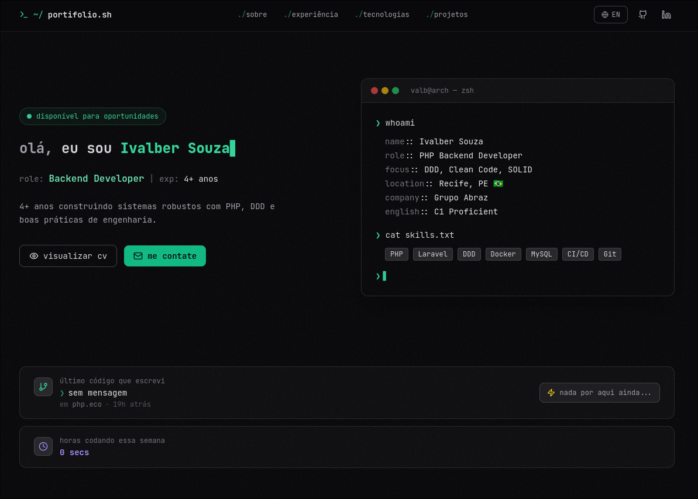

# ~/portifolio.sh

> Portfólio pessoal com estética terminal CLI, bilíngue (PT/EN) e integração com GitHub e WakaTime.



## 🔗 Live

[](https://ivalber-miguel.vercel.app/)

```bash
❯ open https://ivalber-miguel.vercel.app/
```

---

## 🛠 Stack

| Tech | Uso |
|---|---|
| [Next.js 14](https://nextjs.org/) | Framework principal |
| [TypeScript](https://www.typescriptlang.org/) | Tipagem |
| [Tailwind CSS](https://tailwindcss.com/) | Estilização |
| [Lucide React](https://lucide.dev/) | Ícones |
| [GitHub API](https://docs.github.com/en/rest) | Último commit + commits do dia |
| [WakaTime API](https://wakatime.com/developers) | Horas de código na semana |

---

## ✨ Features

- **Estética terminal macOS** — window controls, prompt `❯`, fonte monospace
- **Bilíngue PT/EN** — tradução completa via toggle no header
- **GitHub Activity** — último commit e quantidade de commits do dia em tempo real
- **WakaTime** — horas codando na semana e linguagem favorita
- **Animações de scroll** — terminais, tech cards e project cards animam ao entrar na viewport
- **Typewriter hero** — texto do terminal digita linha por linha ao carregar
- **Foto via GitHub** — avatar puxado diretamente de `github.com/valb-mig.png`
- **Tech icons** — SVGs das tecnologias em `/public/assets/tech/`

---

## 🚀 Rodando localmente

```bash
# clone
git clone https://github.com/valb-mig/portifolio.sh
cd portifolio.sh

# instale as dependências
pnpm install

# configure as variáveis de ambiente
cp .env.example .env.local
# adicione sua WAKATIME_API_KEY no .env.local

# rode
pnpm dev
```

Acesse `http://localhost:3000`

---

## 🔑 Variáveis de ambiente

```env
# .env.local
WAKATIME_API_KEY=sua_api_key_aqui
```

Sua API key do WakaTime está em [wakatime.com/settings/api-key](https://wakatime.com/settings/api-key).

---

## 📁 Estrutura

```
src/
├── app/
│   ├── api/
│   │   └── wakatime/route.ts   # proxy para a API do WakaTime
│   ├── layout.tsx
│   └── page.tsx                # página principal
├── components/
│   └── ui/
│       └── GitActivity.tsx     # bloco GitHub + WakaTime
public/
├── assets/tech/                # SVGs das tecnologias
├── doc/                        # CV em PT e EN
└── img/
    └── logos/                  # logos das empresas
```

---

## 📄 Licença

MIT © [Ivalber Miguel](https://github.com/valb-mig)